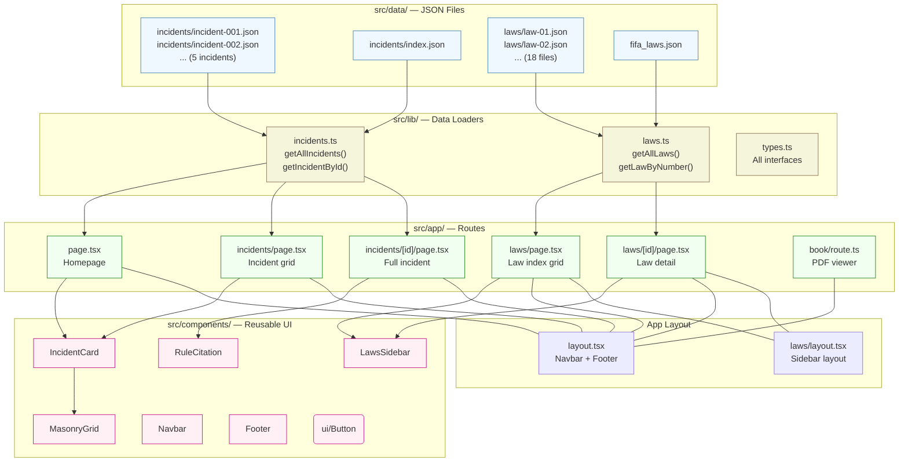

# When the Laws Are Broken by Those Who Enforce Them

**A crowdsourced, evidence-based archive of refereeing mistakes and controversial decisions from FIFA tournaments.**

Every incident is cross-referenced against the official IFAB Laws of the Game 2026/27 to demonstrate exactly where and how the Laws were misapplied. Our goal is to compile a compelling body of evidence showing that certain matches should have been replayed due to serious officiating errors.

---

## Features

- **Incident Archive** — Documented refereeing errors with detailed descriptions, match context, images, and video references
- **Severity Classification** — Each incident tagged as `minor`, `major`, or `critical`
- **Law Cross-References** — Every incident links to the specific IFAB Laws and rules that were violated
- **Full Laws Reference** — All 17 Laws plus the VAR Protocol extracted from the official IFAB PDF, browseable by law and section
- **Full-Screen PDF Viewer** — "The Book" opens the original IFAB PDF in a clean, chrome-free view
- **Static Site Generation** — All pages pre-rendered at build time for fast loads

## Tech Stack

| Tool | Purpose |
|---|---|
| [Next.js 16](https://nextjs.org) (App Router) | Full-stack React framework |
| [React 19](https://react.dev) | UI library |
| [TypeScript 5](https://typescriptlang.org) | Type safety |
| [Tailwind CSS v4](https://tailwindcss.com) | Utility-first styling |
| [shadcn/ui](https://ui.shadcn.com) | Primitive UI components |
| [Biome](https://biomejs.dev) | Linting & formatting |
| [Lucide](https://lucide.dev) | Icons |

---

## Getting Started

```bash
git clone <repo-url>
cd world-cup-corruption
npm install
npm run dev
```

Open [http://localhost:3000](http://localhost:3000) in your browser.

---

## Project Structure



### Directory Map

```
src/
├── app/
│   ├── layout.tsx              # Root layout (Navbar + Footer)
│   ├── page.tsx                # Homepage — featured incidents
│   ├── globals.css             # Tailwind & design tokens
│   ├── book/route.ts           # Full-screen PDF viewer
│   ├── incidents/
│   │   ├── page.tsx            # Incident grid index
│   │   └── [id]/page.tsx       # Incident detail page
│   ├── laws/
│   │   ├── layout.tsx          # Laws sidebar layout
│   │   ├── page.tsx            # Law index grid
│   │   └── [id]/page.tsx       # Law detail page
│   └── pdf/route.ts            # PDF file server
├── components/
│   ├── navbar.tsx              # Top navigation bar
│   ├── footer.tsx              # Site footer
│   ├── incident-card.tsx       # Incident preview card
│   ├── laws-sidebar.tsx        # Law navigation sidebar
│   ├── masonry-grid.tsx        # Responsive CSS grid
│   ├── rule-citation.tsx       # Law citation block
│   └── ui/button.tsx           # shadcn Button
├── data/
│   ├── fifa_laws.json          # Combined law index
│   ├── incidents/
│   │   ├── index.json          # Incident index entries
│   │   ├── incident-001.json   # Individual incident
│   │   ├── incident-002.json
│   │   ├── incident-003.json
│   │   ├── incident-004.json
│   │   └── incident-005.json
│   └── laws/
│       ├── law-01.json … law-17.json  # Full law texts
│       └── var-protocol.json          # VAR Protocol
├── lib/
│   ├── incidents.ts            # Incident data loaders
│   ├── laws.ts                 # Law data loaders
│   ├── types.ts                # All TypeScript interfaces
│   └── utils.ts                # cn() utility
├── components.json             # shadcn configuration
├── next.config.ts              # Next.js configuration
├── biome.json                  # Biome configuration
└── tsconfig.json               # TypeScript configuration
```

---

## Data Schemas

### Incident (`src/data/incidents/incident-XXX.json`)

```typescript
interface Incident {
  id: string;                            // Unique ID (e.g. "incident-001")
  title: string;                         // Short headline for the incident
  summary: string;                       // One-sentence summary (shown in cards)
  match: string;                         // Full match name (e.g. "England vs Germany — Round of 16")
  teams: { home: string; away: string };
  tournament: string;                    // e.g. "FIFA World Cup 2010"
  competitionStage: string;              // e.g. "Round of 16", "Final"
  date: string;                          // ISO date "YYYY-MM-DD"
  referee: string;                       // Referee name
  minute: number | string;               // Match minute of the incident
  description: string;                   // Detailed narrative
  videos: { url: string; title: string }[];
  images: { url: string; caption: string; aspectRatio?: number }[];
  rules: {                              // Cross-referenced laws
    lawNumber: number | string;
    lawTitle: string;
    explanation: string;                 // Why this law applies
  }[];
  severity: "minor" | "major" | "critical";
  wasVARUsed: boolean;
  varOutcome?: string | null;            // If VAR was used, what was the outcome
}
```

### Incident Index (`src/data/incidents/index.json`)

```typescript
interface IncidentIndexEntry {
  id: string;
  title: string;
  summary: string;
  date: string;
  severity: "minor" | "major" | "critical";
  image?: string;                        // Card thumbnail URL
  teams: { home: string; away: string };
}
```

### Law (`src/data/laws/law-XX.json`)

```typescript
interface Law {
  law_number: number | string;
  law_title: string;
  rules: {
    law_number: string;
    law_title: string;
    specific_rule: string;               // Section heading
    exact_quote: string;                 // Verbatim text from the PDF
    page_number: number;                 // Page in the official PDF
  }[];
}
```

### Law Index (`src/data/fifa_laws.json`)

```typescript
interface LawIndexEntry {
  law_number: number | string;
  law_title: string;
  rule_count: number;
}
```

---

## How to Contribute an Incident

Adding a new incident requires two files. No database, no build tooling changes.

### 1. Create the incident JSON

Create `src/data/incidents/incident-006.json`:

```json
{
  "id": "incident-006",
  "title": "Short, descriptive headline",
  "summary": "One-sentence summary shown on card grids.",
  "match": "Team A vs Team B — Stage Name",
  "teams": { "home": "Team A", "away": "Team B" },
  "tournament": "FIFA World Cup YYYY",
  "competitionStage": "Group Stage / Round of 16 / Final",
  "date": "YYYY-MM-DD",
  "referee": "Referee Name",
  "minute": 42,
  "description": "Full detailed narrative of what happened, why it was wrong, and its impact on the match.",
  "videos": [
    { "url": "https://youtube.com/watch?v=...", "title": "Video Title" }
  ],
  "images": [
    {
      "url": "https://example.com/image.jpg",
      "caption": "Descriptive caption",
      "aspectRatio": 1.6
    }
  ],
  "rules": [
    {
      "lawNumber": 5,
      "lawTitle": "The Referee",
      "explanation": "Explain why this law was violated and how it relates to the incident."
    }
  ],
  "severity": "minor",
  "wasVARUsed": false,
  "varOutcome": null
}
```

### 2. Register it in the index

Add an entry to `src/data/incidents/index.json`:

```json
{
  "id": "incident-006",
  "title": "Short, descriptive headline",
  "summary": "One-sentence summary shown on card grids.",
  "date": "YYYY-MM-DD",
  "severity": "minor",
  "image": "https://example.com/thumbnail.jpg",
  "teams": {
    "home": "Team A",
    "away": "Team B"
  }
}
```

### 3. Verify

```bash
npm run build
```

The new incident will be automatically picked up and pre-rendered at `/incidents/incident-006`.

> **Tip:** Refer to existing incidents for examples of good descriptions, rule explanations, and image usage.

---

## IFAB Law Extraction

The laws are extracted from the official IFAB PDF using a Python script. If you need to re-extract or update them:

```bash
pip install -r scripts/requirements.txt
python scripts/fifa_pdf_to_json.py "docs/Laws of the Game 2026_27_single pages.pdf"
```

This outputs 18 JSON files (17 laws + VAR Protocol) into `src/data/laws/`.

---

## Available Scripts

| Command | Description |
|---|---|
| `npm run dev` | Start the development server |
| `npm run build` | Production build with TypeScript checking |
| `npm run start` | Serve the production build |
| `npm run lint` | Run Biome linting |
| `npm run format` | Auto-format all files with Biome |

---

## Contributing Guidelines

1. **One incident per PR** — Keep changes focused and reviewable
2. **Stick to the JSON schema** — Fields are typed; verify with `npm run build`
3. **Use Biome** — Run `npm run lint` before committing; auto-fix with `npm run format`
4. **Severity scale**:
   - `minor` — Incorrect call that didn't affect match outcome
   - `major` — Clearly wrong decision that may have affected the outcome
   - `critical` — Match-changing error that should have led to a replay
5. **Law references** — Every incident must reference at least one IFAB Law with a clear explanation of how it was violated
6. **Images** — Use stable CDN URLs or `https://placehold.co/` placeholders; dimensions roughly 800×500 recommended

---

## License

This project is for educational and research purposes. The IFAB Laws of the Game text is copyright © The International Football Association Board. All incident data is sourced from publicly available match footage and reports.
